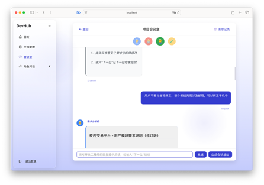

# DevHub全周期智能开发平台设计报告

## 一、界面预览
### 登陆界面

### 主界面


### 项目会议室

### 文档管理

## 二、架构
## 1. 总体架构

本平台采用分层架构设计，将系统划分为四个主要层次，实现关注点分离和模块化设计：

```markdown
┌─────────────────────────────────────────────────┐
│                 前端交互层                        │
│  (React + Tailwind UI + 多Agent交互可视化)        │
└───────────────────────┬─────────────────────────┘
                        │
┌───────────────────────▼─────────────────────────┐
│                 应用服务层                        │
│  (FastAPI + 用户/需求/架构/代码/测试模块)           │
└───────────────────────┬─────────────────────────┘
                        │
┌───────────────────────▼─────────────────────────┐
│                  AI服务层                        │
│  (DeepSeek API + Prompt模板管理)                  │
└───────────────────────┬─────────────────────────┘
                        │
┌───────────────────────▼─────────────────────────┐
│                 数据存储层                        │
│  (MySQL + Redis缓存)                             │
└─────────────────────────────────────────────────┘
```

### 1.1 层次间关系

- **前端交互层与应用服务层**：通过RESTful API进行通信，前端发送HTTP请求，后端返回JSON数据或流式响应
- **应用服务层与AI服务层**：通过服务调用关系，应用服务层调用AI服务层提供的接口生成内容
- **应用服务层与数据存储层**：通过ORM框架(SQLAlchemy)进行数据访问，实现业务逻辑与数据访问分离
- **AI服务层与外部服务**：通过HTTP请求调用DeepSeek API，获取AI生成内容

## 2. 模块架构

### 2.1 核心模块组成

```
┌─────────────────────────────────────────────────┐
│                  FastAPI应用                     │
└───┬─────┬─────┬─────┬─────┬─────┬─────┬─────────┘
    │     │     │     │     │     │     │
┌───▼─┐ ┌─▼───┐┌▼───┐┌▼────┐┌▼───┐┌▼───┐┌▼───────┐
│用户  │ │需求  ││架构││ 代码 ││测试 ││文档││ 需求生成 │
│模块  │ │模块  ││生成││ 生成 ││生成 ││管理││  模块   │
└─────┘ └─────┘└────┘└─────┘└────┘└────┘└────────┘
```

### 2.2 模块间依赖关系

- **用户模块**：基础模块，提供认证和授权服务，被其他所有模块依赖
- **需求模块**：依赖用户模块，存储和管理用户创建的需求
- **需求生成模块**：依赖用户模块和AI服务，根据用户输入生成详细需求文档
- **架构生成模块**：依赖需求模块和AI服务，根据需求生成系统架构设计
- **代码生成模块**：依赖架构模块和AI服务，根据架构设计生成代码
- **测试生成模块**：依赖代码模块和AI服务，根据代码生成测试用例
- **文档管理模块**：依赖所有其他模块，整合各阶段成果生成完整文档

### 2.3 模块调用流程

1. 用户通过前端提交需求主题
2. 需求生成模块调用AI服务生成详细需求文档
3. 架构生成模块基于需求文档调用AI服务生成架构设计
4. 代码生成模块基于架构设计调用AI服务生成模块代码
5. 测试生成模块基于模块代码调用AI服务生成测试用例
6. 文档管理模块整合各阶段成果生成完整项目文档

## 3. 数据流架构

系统数据流设计清晰，形成完整的智能软件开发链路：

```
┌──────────┐    ┌──────────┐    ┌──────────┐    ┌──────────┐
│  需求输入 │───►│  架构生成  │───►│  代码生成 │───►│  测试生成 │
└──────────┘    └──────────┘    └──────────┘    └──────────┘
      │               │               │               │
      ▼               ▼               ▼               ▼
┌──────────┐    ┌──────────┐    ┌──────────┐    ┌──────────┐
│需求文档   │    │  架构设计  │    │ 模块代码  │    │ 测试用例  │
└──────────┘    └──────────┘    └──────────┘    └──────────┘
                                                      │
┌──────────┐                                          │
│  文档生成 │◄─────────────────────────────────────────┘
└──────────┘
      │
      ▼
┌──────────┐
│ 项目文档  │
└──────────┘
```

## 3. 前后端与数据库关系

### 3.1 前后端交互模式

前后端采用完全分离的架构，通过RESTful API进行通信：

```
┌─────────────┐                 ┌─────────────┐
│             │  HTTP请求/响应   │             │
│   前端应用   │◄──────────────► │  后端API     │
│  (React)    │                 │  (FastAPI)  │
│             │                 │             │
└─────────────┘                 └──────┬──────┘
                                       │
                                       │ ORM
                                       │ 
                                ┌──────▼──────┐
                                │             │
                                │   数据库     │
                                │  (MySQL)    │
                                │             │
                                └─────────────┘                     
```

### 3.2 前后端通信详细设计

1. 认证流程
   - 前端发送用户凭证到`/api/user/login`
   - 后端验证凭证并返回JWT令牌
   - 前端存储令牌并在后续请求中通过Authorization头部发送
2. 数据交互
   - 前端通过Axios等HTTP客户端发送请求
   - 后端接收请求，进行参数验证和业务处理
   - 后端返回JSON格式数据或流式响应
   - 前端解析响应并更新UI
3. 实时通信
   - 对于生成类任务，采用SSE(Server-Sent Events)实现流式响应
   - 前端通过EventSource接收流式数据并逐步更新UI

### 3.3 后端与数据库交互

后端通过SQLAlchemy ORM框架与数据库交互：

1. 数据访问层

   ：

   - 使用SQLAlchemy模型定义数据结构
   - 通过会话(Session)管理数据库连接
   - 实现CRUD操作与事务管理

2. 连接池管理

   ：

   - 使用连接池优化数据库连接
   - 通过依赖注入提供数据库会话

3. 缓存策略

   ：

   - 使用Redis缓存频繁访问的数据
   - 实现缓存失效和更新机制

## 5. 智能Agent架构

系统设计了多个专业Agent角色，各司其职，协同工作：

```
┌───────────────────────────────────────────────────────┐
│                    Agent控制面板                        │
└───────────┬───────────┬───────────┬───────────────────┘
            │           │           │
    ┌───────▼───┐ ┌─────▼─────┐ ┌───▼───────┐ ┌─────────┐
    │产品经理    │ │ 架构师     │ │ 开发者     │ │ 测试     │
    │Agent      │ │Agent      │ │Agent      │ │Agent    │
    └───────────┘ └───────────┘ └───────────┘ └─────────┘
       需求分析      架构设计       代码生成      测试生成
```

## 6. 服务架构

### 6.1 后端服务架构

后端采用分层设计，实现业务逻辑与数据访问分离：

```
┌─────────────────────────────────────────────────┐
│                  API路由层                       │
│  (用户/需求/架构/代码/测试路由)                     │
└───────────────────────┬─────────────────────────┘
                        │
┌───────────────────────▼─────────────────────────┐
│                  业务逻辑层                       │
│  (需求/架构/代码/测试生成服务)                      │
└───────────────────────┬─────────────────────────┘
                        │
┌───────────────────────▼─────────────────────────┐
│                  数据访问层                       │
│  (SQLAlchemy ORM)                               │
└───────────────────────┬─────────────────────────┘
                        │
┌───────────────────────▼─────────────────────────┐
│                  数据存储层                       │
│  (MySQL/Redis)                                  │
└─────────────────────────────────────────────────┘
```

### 6.2 前端服务架构

前端采用组件化设计，实现UI与业务逻辑分离：

```
┌─────────────────────────────────────────────────┐
│                  页面组件                         │
│  (登录/仪表盘/聊天/文档页面)                        │
└───────────────────────┬─────────────────────────┘
                        │
┌───────────────────────▼─────────────────────────┐
│                  通用组件                        │
│  (头部/侧边栏/代码编辑器)                          │
└───────────────────────┬─────────────────────────┘
                        │
┌───────────────────────▼─────────────────────────┐
│                  服务层                          │
│  (API调用/认证服务)                               │
└───────────────────────┬─────────────────────────┘
                        │
┌───────────────────────▼─────────────────────────┐
│                  状态管理                        │
│  (Context/Redux)                                │
└─────────────────────────────────────────────────┘
```

## 7. 数据架构

### 7.1 数据库架构

系统采用关系型数据库设计，主要实体关系如下：

```
┌─────────┐       ┌────────────┐       ┌─────────┐
│  用户    │◄──────┤    需求    │◄──────┤  任务    │
└─────────┘   创建 └────────────┘  关联 └─────────┘
                                          │
                                          │ 生成
                                          ▼
┌─────────┐      ┌────────────┐       ┌─────────┐
│ 架构设计 │◄──────┤  模块代码   │◄──────┤ 测试用例 │
└─────────┘  关联 └────────────┘  关联 └─────────┘
     │              │                │
     └──────────────┴────────────────┘
                    │
                    ▼
               ┌─────────┐
               │  文档    │
               └─────────┘
```

### 7.2 缓存架构

系统采用Redis缓存提升性能：

```
┌─────────────────┐      ┌─────────────────┐
│  API请求         │─────►│  Redis缓存      │
└─────────────────┘      └────────┬────────┘
        │                         │
        │ 缓存未命中              │ 缓存命中
        ▼                         │
┌─────────────────┐               │
│  数据库查询       │               │
└────────┬────────┘               │
         │                        │
         └────────────────────────┘
                   │
                   ▼
         ┌─────────────────┐
         │  返回结果        │
         └─────────────────┘
```

## 8. AI服务架构

### 8.1 大模型调用架构

系统采用统一的大模型调用接口，支持不同类型的生成任务：

```
┌─────────────────────────────────────────────────┐
│                 DeepSeek API                    │
└───────────┬───────────┬───────────┬─────────────┘
            │           │           │
    ┌───────▼───┐ ┌─────▼─────┐ ┌───▼───────┐
    │需求生成     │ │架构生成    │ │代码生成    │
    │服务        │ │服务        │ │服务       │
    └───────────┘ └───────────┘ └───────────┘
```

### 8.2 流式输出架构

系统支持流式输出，提升用户体验：

```
┌────────────┐    请求     ┌────────────┐    调用    ┌────────────┐
│  前端UI     │ ─────────► │  后端API    │ ─────────►│ DeepSeek   │
└────────────┘            └────────────┘            └────────────┘
      ▲                         │                         │
      │                         │                         │
      └─────────────────────────┴─────────────────────────┘
                         流式返回数据
```

## 9. 部署架构

系统支持多种部署方式，适应不同规模的团队需求：

```
┌─────────────────────────────────────────────────┐
│                 单机部署                         │
└─────────────────────────────────────────────────┘
   ┌─────────┐  ┌─────────┐  ┌─────────┐
   │ 前端     │  │ 后端    │  │  数据库  │
   └─────────┘  └─────────┘  └─────────┘

┌─────────────────────────────────────────────────┐
│                 分布式部署                        │
└─────────────────────────────────────────────────┘
   ┌─────────┐     ┌─────────┐     ┌─────────┐
   │ Nginx   │────►│ FastAPI │────►│ MySQL   │
   └─────────┘     └─────────┘     └─────────┘
                        │
                   ┌────▼────┐
                   │ Redis   │
                   └─────────┘
```

## 10. 技术栈架构

```
┌─────────────────────────────────────────────────┐
│                 技术栈架构                        │
└───────────┬───────────┬───────────┬─────────────┘
            │           │           │
    ┌───────▼───┐ ┌─────▼─────┐ ┌───▼───────┐ ┌────────┐
    │前端        │ │后端       │  │AI服务     │ │数据存储 │
    │React      │ │FastAPI    │ │DeepSeek   │ │MySQL   │
    │Tailwind   │ │SQLAlchemy │ │API        │ │Redis   │
    └───────────┘ └───────────┘ └───────────┘ └────────┘
```

